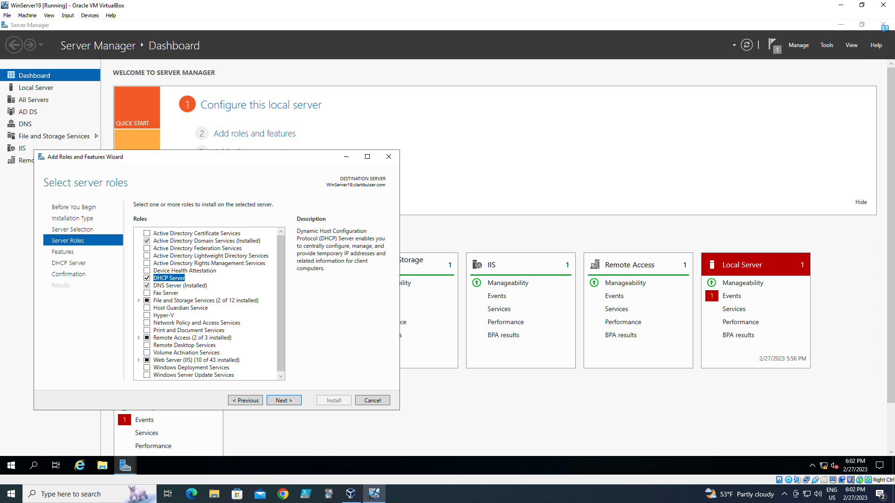
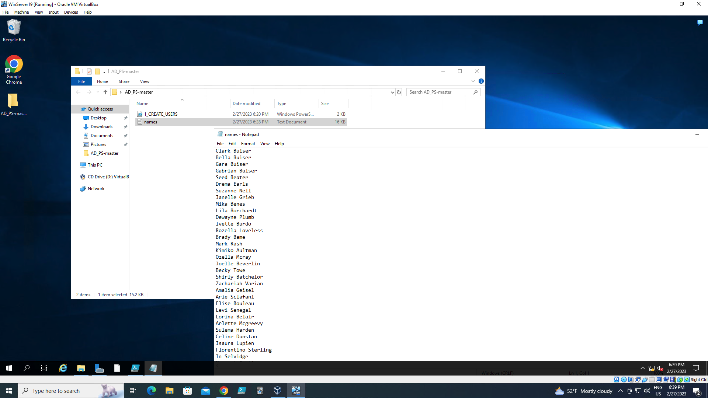

# Configuring Active Directory (On-Premises) Within VirtualBox VM.
###### This tutorial outlines the implementation of on-premises Active Directory within VirtualBox VM.

## Environments and Technologies Used

- VirtualBox
- Active Directory Domain Services
- PowerShell

## Operating Systems Used

- Windows Server 2019
- Windows 10 (21H2)

## High-Level Deployment and Configuration Steps

- Install VirtualBox VM
- Install Windows Server 2019
- Install and configure Active Directory
- Ensure Connectivity between the client and Domain Controller
- Create an Admin and Normal User Account in AD
- Join Client1 (Windows 10 VM) to domain (clarkbuiser.com)
- Run Powershell script that will automatically create hundreds of users
- Create another VM and install Windows 10 and connect to the domain controller then log in to damain account.

## Deployment and Configuration Steps

Install VirtualBox on host PC.

- *Enable Intel VMX virtualization in BIOS*
- *Bios > Advance > CPU config >  Intel VMX virtualization > Enable*

## Install Windows Server 2019

- *Virtual box > new > follow prompt*

- *VM Manager > Settings > general > advanced > shared clipboard and Drag 'n Drop > bidirectional x2 > System > Processor > set parameters > network > adapter 1 > attached to: NAT > Adapter 2 > enable network adapter > Attached to:  Internal Network*

- *Complete installation..*
- *Install vm guest edition:  Devices > Insert Guest Addtions CD image*
- *Explorer folder > This PC > CD Drive > VBoxWIndowsAdditions-amd64 > install.. > reboot*
- *Setup IP Address: Open Network and Internet settings > Find Internal and External NIC > rename to LAN and WAN.*
- *Assign static IP to LAN: 172.16.0.1 > Subnet Mask: 255 255 255 0 > Default gateway:blank > Preferred DNS: 127.0.0.1 (loopback address)*

- *Rename PC to WinServer19*

## Install Active Directory Domain Services
- *Add roles and features > Active Directory Domain Services*

- *Click notification flag > promote this server > Add new forest > Root domain name: clarkbuiser.com > add password > follow prompt and install > restart*

- *Create dedicated AD Admin account: Start > administrative tools > Active Directory Users and Computers > clarkbuiser.com > new > Organization Unit > Name: _ADMINS > uncheck protection container for accidental deletion.*

- *_Admin > new > user > user logon name: a-cbuiser*
- *Right click Clark Buiser user acct > protperties > member of > add > enter the object names... = domain admins > Check Names > ok*

- *Sign Out Windows*

- *Log in > other user > a-cbuiser > enter password*

## Install Remote Access and NAT
- *Add roles and features > next > Server roles > Remote Access > routing > add features > next > install* 

- *Tools > routing and remote access > WINSERVER19 local > Configure and Enable Routing and Remote Access > next > NAT > Select WAN (Internet Interface) > next > finish > check configuration settings.*

## Set up DHCP server on the Domain Controller
- *Add roles and features > DHCP server > install*

- *Tools > DHCP > winserver19.clarkbuiser.com > IPV4 > > new scope > Name: 172.16.0.100-200 > next > Start IP address: 172.16.0.100, End IP: 172.16.0.200 Length: 24, Subnet mask: 255.255.255.0 > next > next > configure DHCP options: yes > 172.16.0.1 (gateway) > add  > parent domain: clarkbuiser.com > next > yes, i want to activate the scope > finish*

- *winserver19.clarkbuiser.com > authorize > refresh* 
- *Server Manager > configure this local server > IE Enhanced Security Configuration: off*

## Create a bunch of users with Powershell:
- *Save AD_PS-master folder (folder that contain Powershell script and text files of names of users) to Desktop*

- *Open PowerShell ISE as Administrator*
- *In PowerShell > Set-ExecutionPolicy Unrestricted*
- *Change directory to Desktop: cd c:\users\a-cbuiser\desktop\AD_PS-master*
- *ls > play*

##### I hope this tutorial helped you learn a little bit on setting up Active Directory in VirtualBox.

